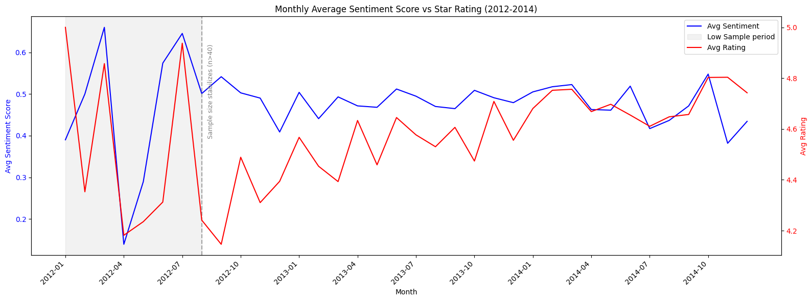
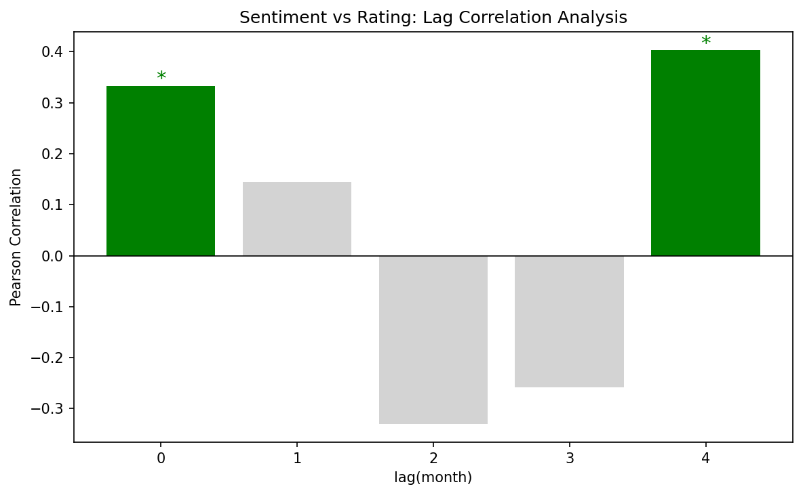

# Voice of Customer Sentiment Analysis
### Do Amazon Review Sentiments Predict Star Ratings?

---

## Overview

This project applies NLP sentiment analysis to 4,914 Amazon SD card reviews (2012–2014) to test a common assumption in VOC analysis: **can customer sentiment serve as an early warning signal for rating changes?**

The answer, supported by time-series trend analysis and lag correlation, is **no** — sentiment and ratings move synchronously. This finding has a direct business implication: VOC sentiment is better deployed as a real-time monitoring tool alongside ratings, not as a standalone predictive indicator.

---

## What Makes This Project Different

Most sentiment analysis projects stop at scoring text. This one goes further:

- **Model validation** — 80 reviews manually labeled to quantify VADER's reliability (80% agreement rate) and categorize 6 systematic failure patterns
- **Methodological self-correction** — identified and corrected a flaw in the direction consistency analysis (inconsistent noise filtering between sync and divergence groups)
- **Honest conclusions** — the dataset is stable, meaningful fluctuations are rare, and the analysis reflects that rather than overstating findings

---

## Analysis Pipeline

| Step | Description |
|---|---|
| EDA & Cleaning | Inspect data quality, handle missing values, convert date formats |
| Sentiment Scoring | VADER compound scores for all 4,914 reviews |
| Manual Validation | 80-sample human annotation; 80% agreement; 6 failure patterns documented |
| Time Aggregation | 36 monthly data points (avg sentiment, avg rating, review count) |
| Trend Analysis | Direction consistency with noise filtering (0.5 SD threshold) |
| Lag Correlation | Pearson correlation at lag 0–4 months |

---

## Key Results

**Monthly Sentiment vs Star Rating (2012–2014)**


**Lag Correlation Analysis**


| Lag | Correlation | p-value | Interpretation |
|---|---|---|---|
| 0 | 0.33 | 0.047 ✅ | Synchronous co-movement |
| 1–3 | — | >0.05 ❌ | No short-term leading relationship |
| 4 | 0.40 | 0.022 ✅ | Likely seasonal artifact, not causal |

---

## Limitations

| Category | Detail |
|---|---|
| Model | VADER ~20% misclassification; fails on negation, transitional structures, calm narrative negatives |
| Data | Uneven monthly sample sizes (7–306); early period (2012-01 to 2012-08) flagged as unreliable |
| Scope | Single product, 3-year window — findings may not generalize |
| Method | Lag correlation cannot distinguish genuine leading relationships from seasonal co-movement |

---

## Requirements
```
pandas / matplotlib / vaderSentiment / scipy / openpyxl
```

## Data Source
[Kaggle: tarkkaanko/amazon](https://www.kaggle.com/datasets/tarkkaanko/amazon) — CC BY-NC-SA 4.0
